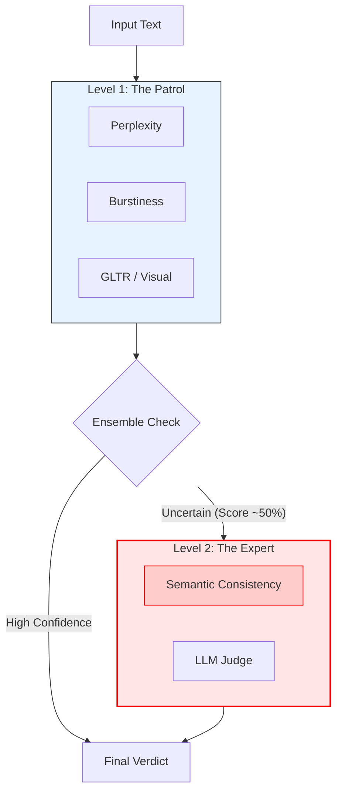

# Aletheia: Digital Forensics for the AI Era

> *Aletheia (Greek: ἀλήθεια) - The state of not being hidden; disclosure; truth.*


[](https://youtu.be/Y8EHyhkmRsk)

---

## 🚨 The Declaration
**Statistical detection is dead.**

For years, we relied on simple metrics—perplexity, burstiness, n-grams—to spot machines. But modern models like **Gemini 3 Pro** and **GPT-4** have learned to mimic these human statistical fingerprints perfectly. They are "bursty," they make "typos," and they optimize against our old detectors.

**Aletheia** is the response to this new reality. It is not just a tool; it is a **forensic framework** designed for a world where "human-like" is no longer proof of humanity. We don't just count words; we interrogate the cognitive integrity of the narrative.

---

## 🛡️ Defense in Depth Strategy

Aletheia operates on a military-grade **Two-Tier Architecture**. We stop the obvious bots at the gate, and we send the detectives after the sophisticated impostors.

### Level 1: The Patrol (Rapid Response)
*Fast, cheap, and effective against standard bots (ChatGPT 3.5, Llama 2).*

| Sensor           | Theory                | The "Tell"                                                |
| :--------------- | :-------------------- | :-------------------------------------------------------- |
| **`Perplexity`** | Information Entropy   | Text is too "smooth" and predictable.                     |
| **`Burstiness`** | Structural Variance   | Sentence structure is monotonous (flat rhythm).           |
| **`GLTR`**       | Visual Forensics      | Over-reliance on Top-10 commonly predicted words.         |
| **`TF-IDF`**     | Stylistic Fingerprint | Abuse of academic "filler" words (*"delve", "tapestry"*). |

### Level 2: The Expert (Semantic Investigation)
*The heavy artillery. Deployed when statistical metrics are inconclusive.*

| Sensor                    | Theory              | The "Tell"                                                        |
| :------------------------ | :------------------ | :---------------------------------------------------------------- |
| **`SemanticConsistency`** | **Meta-Cognition**  | **The Hallucination Loop.** Models lose logical thread over time. |
| **`LLMJudge`**            | Adversarial Parsing | Lack of specific, verifiable anecdotes; "generic fluff".          |

---

## 🔬 The Forensic Architecture

We employ a **Stacked Generalization** approach based on the *Condorcet Jury Theorem*: aggregating the verdict of multiple weak learners (The Patrol) with a strong meta-learner (The Expert).



---

## 🕵️‍♂️ Equip the Lab (Installation)

1.  **Clone the Repository**
    ```bash
    git clone https://github.com/julienmiquel/Aletheia.git
    cd aletheia-detector
    ```

2.  **Install Dependencies**
    ```bash
    pip install -e .
    python -m spacy download en_core_web_sm
    ```

3.  **Authorize the Specialist (Optional)**
    To use Level 2 features (Semantic Analysis), you need a Gemini API key.
    ```bash
    export GEMINI_API_KEY="your_api_key_here"
    ```

---

## 🔎 Start an Investigation (Usage)

### 1. The Full Autopsy (Ensemble)
The `EnsembleDetector` automatically manages the escalation from Level 1 to Level 2.

```python
from ia_detector.ensemble import EnsembleDetector

# Initialize the forensic suite
detector = EnsembleDetector()

suspect_text = "In conclusion, it is crucial to delve into..."

# Run analysis (use_semantic=True authorizes Level 2 escalation)
evidence = detector.predict(suspect_text, use_semantic=True)

print(f"Verdict: {evidence['verdict']}")
print(f"Confidence: {evidence['combined_score']}%")
if evidence['metrics']['semantic_consistency']:
    print(f"Logical Flaws Found: {evidence['metrics']['semantic_consistency']}")
```

### 2. The Visual Dashboard
For a real-time investigation, launch the interactive command center:

```bash
run.sh app
# or
streamlit run app.py
```
*Features the **"Sea of Green"** visualization: Watch AI text light up as highly predictable tokens are highlighted in real-time.*

### 3. Command Line Utilities
We provide a unified CLI `run.sh` to manage your forensic tools:

*   **`./run.sh adversarial`**: Launch the **Red Team**. Generates "Humanized" AI attacks to test your defenses.
*   **`./run.sh benchmark`**: Run the full battery of tests against IMDb vs Gemini.
*   **`./run.sh verify`**: Quick check of the Semantic capabilities.

---

## 📁 Case Files (Documentation)

*   **[The Theory](docs/theory/)**: The mathematical proof behind the methods.
    *   [Adversarial Training (Red vs Blue)](docs/theory/adversarial_training.md)
    *   [Semantic Consistency](docs/theory/semantic_consistency_framework.md)
*   **[Field Manuals](docs/practical/)**: How to tune and deploy detectors.
*   **[Developer Guide](GEMINI.md)**: Architecture internals and Lazy Loading patterns.

---

## 📜 Citation

If Aletheia helps your investigation, please cite the framework:
```
@software{aletheia2025,
  author = {Miquel, Julien},
  title = {Aletheia: Digital Forensics Framework for AI Detection},
  year = {2025},
  url = {https://github.com/julienmiquel/Aletheia}
}
```
