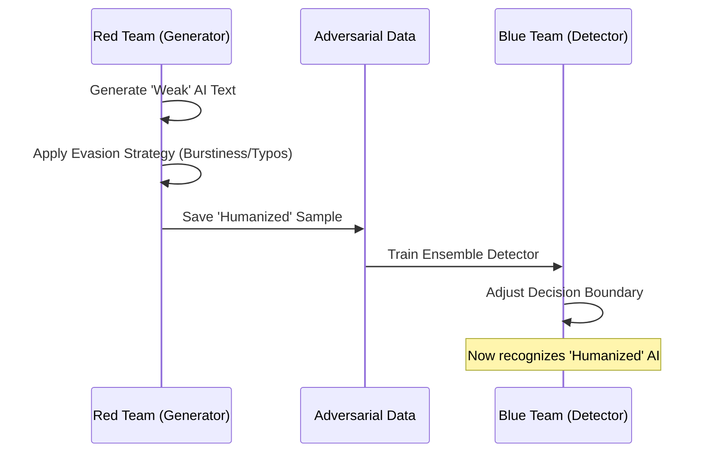

# Adversarial Training: The "Red Team" Approach

In the context of AI detection (and specifically Aletheia), **Adversarial Training** is a technique to enhance robustness by training the detector not just on "obvious" AI text, but on AI text that has been deliberately disguised to look human.

Think of it like a vaccination: you expose the system to a weakened version of the "virus" (the evasion attacks) so it learns to recognize them.

## The Workflow

Aletheia employs a **Red Team / Blue Team** loop to improve detection capabilities.

### 1. The Attack (Red Team)
The `scripts/generate_adversarial_data.py` script acts as an intelligent adversary. It uses a strong LLM (e.g., Gemini Pro) to actively rewrite weak AI content to evade detection.

*   **Step A (Base Generation):** Generate standard AI text (using a lighter model like Gemini Flash). This text typically scores low on perplexity and burstiness.
*   **Step B (The Disguise):** Prompt a stronger model to *humanize* that text using specific strategies:
    *   **Burstiness Injection:** "Vary sentence length drastically."
    *   **Perplexity Injection:** "Use specific, vivid anecdotes and colloquialisms."
    *   **Imperfection:** "Make it less 'perfect' and structure it less rigidly."

### 2. The Defense (Blue Team)
The generated `adversarial_samples.json` dataset is then fed into the `EnsembleDetector`'s training loop.

*   **Without Adversarial Training:** The detector learns `Simple AI` vs `Human`. It might be 99% accurate on standard ChatGPT output but fails against "Humanized" output.
*   **With Adversarial Training:** The detector learns to distinguish `Human` from `Simple AI` AND `Humanized AI`.

## Why this is critical

Standard statistical detectors (like GLTR or Perplexity) rely on AI being "average." When specific prompts force an LLM to be "bursty" or "imperfect," these statistical fingerprints are obscured. Adversarial training forces the final Ensemble model (and the upcoming Semantic Consistency Analyzer) to look for deeper signs of inconsistency rather than just relying on surface-level statistics.
